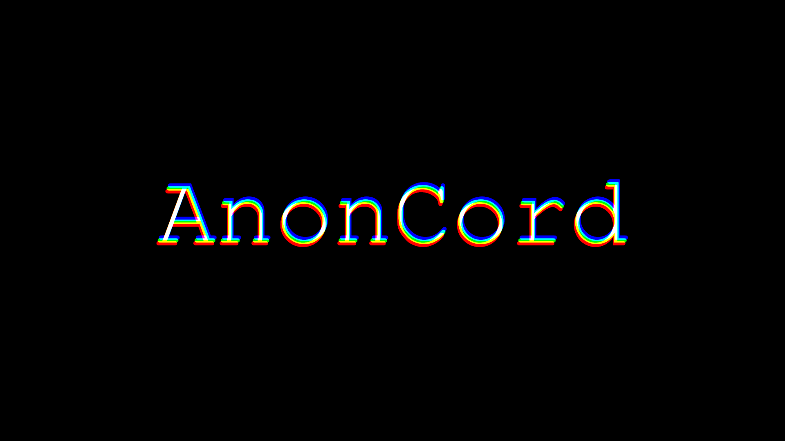
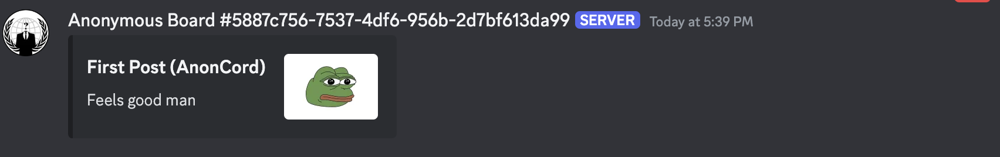

# Anonymized Chat Concept For Discord 

# Why? 
Anonymized chat increases privacy protection. Harassment and stalking are growing concerns within Discord servers, especially towards marginalized groups, many of whom turn to Discord to seek community.
 
Anonymity helps users stay safe and secure. 
# How? 
This is not an orginal concept, I did not find this method, however I did create the bot that would allow this concept to be viable and scalable. (*I could not find the youtube video that did this, unfortunately*). 

It works by using **Discord's Private News Channels**. News Channels have an option to **follow** and **publish** to a channel using a **webhook** instead of a regular message. Using this user's can post webhook messages, concealing their name. Further functionality is added such as a post messaging system and preventing non embeded messages from being send in order to provide a clean UI experience.

---

---
Essentially, an anonymized message board. 
# Setup 
In order to implement this anonymized chat concept in your own Discord Server, follow the steps below. 
1. Enable Community on your Discord Server
2. Create a Discord Bot (Python) and get it's save its token.
3. Fork the Git Repo and clone it. 
4. install the requirements.txt `pip install -r requirements.txt`. 
5. Paste your token within the parentheses of `client.run()` in the `main.py`.
6. Modify and edit the code to your liking and use case 😊.
7. *Note that the code is dependent on specific roles on the sever (`Admin`), so please change them.*
# Vision 
My vision for this project is to turn this concept into a network of decentralized anonymized message boards. That is why you can make your own instance of this bot for your own server. In short, my advice is to only use one instance per server, any more and tranparency will be lost, groups will form, and monopolies will emerge.

*Remember to always make sure it is open source* 😊
